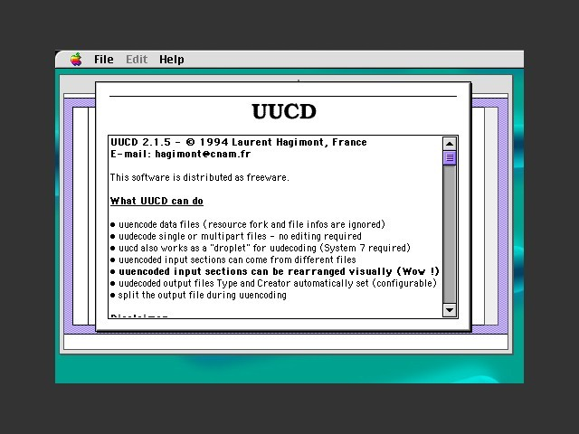

# uucd

Source : https://www.macintoshrepository.org/26458-uucd-2-x

__uucd__ est une application pour mac pré-MacOSX, pour encoder/décoder les fichiers uucode, abondamment utilisés dans les années 90 dans les newsgroups Usenet. Il détecte automatiquement la partie utile des messages, laissant de côté les entêtes, commentaires, signatures et peut même reconnaître des lignes uuencodées partiellement maltraitées par les systèmes de transport. Elle s'adresse donc à un écosystème aujourd'hui disparu.

__uucd__ is a pre-MacOSX mac application, to encode/decode uucode files, abundantly used in the 90s un Usenet newsgroups. It detects automatically the messages useful parts, leaving headers, comments, signatures and can even handle uuencoded lines partially damaged by transport systems. So it concerns a now forgotten ecosystem.
